# Modern Data Integrations: A Beginner-Friendly Guide

This guide explains how to build reliable, modular, and composable data integrations. It defines every technical term as it appears, includes short examples, and links you to trusted resources for learning more. It emphasizes **functional programming** (FP: writing programs by composing small, pure functions that avoid shared mutable state) and three stacks: **TypeScript**, **Python**, and **Scala**.

## Who this is for

- Engineers and analysts who want to connect data sources to destinations in a robust way.
- Teams adopting modern patterns like **ELT** (Extract, Load, Transform: load raw data first, transform later), **CDC** (Change Data Capture: streaming row-level changes from source databases), and **event-driven** (systems that react to events rather than polling on a schedule) architectures.

## How to read this guide

- Every term is defined inline the first time it appears.
- Examples are short and focus on the core idea.
- Pros and cons are listed so you can make pragmatic choices.

---

## TL;DR

- Start with data contracts and schemas; validate at the edges. Keep core logic pure and side‑effects at the boundaries.
- Batch by default; adopt streaming only for freshness/SLAs. If streaming, use event time, watermarks, and explicit late‑data policies.
- Prefer ELT for analytics; use ETL for operational sinks that need pre‑modeled data.
- Use CDC (Debezium/Kafka Connect) when sources allow; plan snapshots, gaps, and schema evolution from day one.
- Make every step idempotent with deterministic keys/manifests; add OpenTelemetry metrics/logs/traces for observability.
- Orchestrate with Dagster/Temporal/ADF; transform with dbt/Spark; design for replay/backfill and DLQs.
- Security: least privilege, secrets in a vault, PGP/mTLS for partners, log redaction; meet GDPR/CIP/IEC 62443 where applicable.
- Deploy where it fits: iPaaS/serverless for SaaS flows; Kubernetes for high‑throughput/custom; warehouse‑native for ELT; on‑prem/Hyper‑V for OT/regulatory.
- Stay portable: implement core in Python or Go; expose CLI JSON in/out and HTTP/gRPC façades; keep provider/orchestrator adapters thin.
- Microsoft estate: APIM → Functions → Service Bus; Event Hubs → ADLS/Synapse; Purview + Private Endpoints.
- Utilities: OT → edge gateway → log → stream → TSDB/lake; UTC/timezone discipline; estimation/substitution flags; regulatory exports.
- Reliability/perf: checkpointing, retries with jitter, DLQs; SLOs on freshness/latency/error rate; compact/merge and tune costs.

---

## Core principles and why they matter

### Data contracts

A clear, versioned agreement on fields and meaning. Prevents **breaking changes** (changes that cause dependent systems to fail).

**Tools**: [JSON Schema](https://json-schema.org/), [OpenAPI](https://www.openapis.org/) (HTTP API description format), [Protocol Buffers](https://protobuf.dev/) (binary schema with code generation).

### Schemas and validation

Validate **at the edge** (right where data enters your system). TypeScript [Zod](https://zod.dev/), Python [Pydantic](https://docs.pydantic.dev/), Scala [Circe](https://circe.github.io/circe/) ensure bad inputs **fail fast** (fail early with clear errors).

### Idempotency

Design **upserts** (update or insert depending on existence) and merges so retries do not duplicate data. Use **natural keys** (business-meaningful unique identifiers) or **surrogate keys** (system-generated identifiers) plus **deduplication** (removing duplicates).

### Observability

Emit **metrics** (numeric measurements), **logs** (text records of events), and **traces** (end-to-end request timelines). Use [OpenTelemetry](https://opentelemetry.io/) (open standard for telemetry) to instrument consistently.

### Composability

Build small **pure functions** (no side effects) and **compose** them (combine functions to build behavior). Keep **I/O** (input/output like network and disk) at the boundaries.

### Backpressure and retries

**Backpressure** (slowing intake when downstream is slow) protects systems. Use **exponential backoff** (increasing retry delays) and **circuit breakers** (temporarily stop calls to a failing service).

### Security and governance

Classify data (tag by sensitivity), handle **PII** (personally identifiable information) properly, and **audit access** (record who did what and when).

---

## Choosing patterns: when to use what

### ETL vs ELT

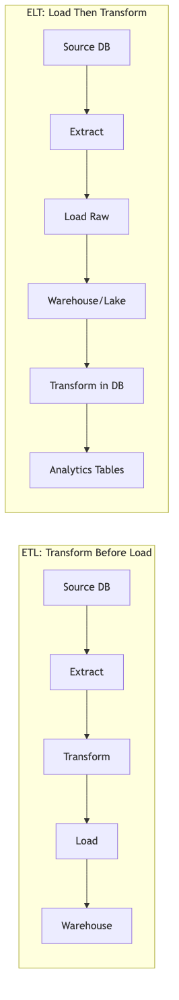

#### ETL (transform before load)

Good when the destination must receive clean, modeled data.

- **Pros**: faster queries on arrival, smaller storage.
- **Cons**: less raw history, harder to re-model later.

**Learn more (summaries)**
- dbt docs: dbt is SQL-first transformation with versioned models, tests, and environments; the docs cover modeling patterns (staging/marts), tests, and CI/CD for analytics ELT.
- Snowflake data load best practices: guidance on file formats, micro-batching, COPY options, and performance/warehouse sizing for efficient ingests.
- BigQuery loading best practices: recommendations on ingest formats (Parquet/Avro), partitioning/clustering, streaming inserts vs batch loads, and cost controls.

#### ELT (load then transform)

Good for analytics and agility.

- **Pros**: keeps raw history, flexible transformations.
- **Cons**: requires warehouse or lake compute and governance.

#### Deep dive: ETL vs ELT
- Where transforms run
  - ETL: transforms in an intermediate compute (ETL tool, Spark job) before the destination; the destination receives curated data only.
  - ELT: raw lands first; transforms run inside the warehouse/lakehouse (SQL/dbt) or over lake engines (Spark/Flink).
- Cost and performance
  - ETL: pay compute outside the warehouse; smaller storage footprint but fewer chances to re‑model.
  - ELT: store once, compute many; exploit MPP/elastic warehouses; use columnar formats (Parquet) and table formats (Delta/Iceberg/Hudi).
- Latency and freshness
  - ETL: faster queries at arrival (already modeled) but longer pipelines to build.
  - ELT: faster ingest, model later; streaming ELT uses incremental MERGE/UPSERT into ACID tables.
- Governance and lineage
  - ETL: curated inputs, fewer consumers; lineage spans multiple systems.
  - ELT: raw + refined kept; strong lineage from raw → silver → gold with tests and contracts at each hop.
- Backfills and reproducibility
  - ETL: often re‑extract from sources; risk of drift if sources changed.
  - ELT: replay from raw (bronze) deterministically; versioned models and time travel.
- When to choose
  - ETL: operational sinks (PSPs, ERPs) that require strict interfaces; sensitive PII minimization before landing.
  - ELT: analytics/ML feature pipelines, exploratory modeling, and incremental CDC.

#### Medallion architecture (Bronze/Silver/Gold)
- Bronze (a.k.a. Raw/Landing)
  - Purpose: immutable landing of raw events/files; one row per event/record; minimal parsing; append‑only.
  - Contracts/metadata: source id, ingest time, checksum, schema_version, file_name/offsets; store as Parquet (preferred) or JSON.
  - Quality: basic schema validation, quarantine corrupt rows; no business rules enforced.
  - Retention: longest; enables replay/backfill; partition by ingest_date/source.
- Silver (a.k.a. Cleaned/Conformed)
  - Purpose: normalized types, deduplicated, conformed dimensions (ids, enums), PII handling (mask/tokenize), timezone normalization (UTC).
  - Quality: strong schema with constraints (not null, value ranges), referential checks, idempotent MERGE from bronze.
  - Patterns: SCD Type 1 for corrections, Type 2 for history; CDC apply with upserts and tombstones.
  - Partition/sort: business keys and updated_at for efficient merges.
- Gold (a.k.a. Business marts/serving)
  - Purpose: business‑ready aggregates (facts/dimensions), KPIs, denormalized wide tables for BI and APIs.
  - Quality: dbt tests (unique, not_null, relationships), reconciliation totals; SLAs on freshness.
  - Patterns: incremental models with window boundaries; snapshot tables for point‑in‑time reporting.
- Optional layers: Platinum/Features for low‑latency serving (feature store), Sandbox for experiments (short retention).

Operational rules
- Every hop is idempotent and test‑gated; schema versions are explicit and backward compatible.
- Use ACID table formats (Delta/Iceberg/Hudi) for upserts/time travel; vacuum/compact regularly.
- Document the contract per layer; expose catalog/lineage (DataHub/Purview) and SLAs.

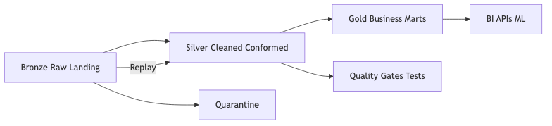

#### Where SQL fits in data integrations
- Set-based transforms in ELT: normalization, dedupe, conformance, SCDs, aggregates, marts (Bronze → Silver → Gold) using dbt/SQL engines.
- Pushdown extraction: projection and filtering at source to reduce egress (only required columns/rows) for batch/incremental pulls.
- CDC apply: MERGE/UPSERT operations to apply change streams into ACID tables with idempotent keys and deterministic ordering.
- Reverse ETL selection: SQL SELECTs for downstream sync targets, with windowing and watermark conditions.
- Quality and contracts: SQL constraints, expectation queries, and dbt tests (not null, unique, relationships) as gates.
- Serving: views/materialized views for stable interfaces; performance-tuned with indexes/cluster keys/partitioning.
- Not for orchestration/connectors: keep control flow, retries, partner auth, and side-effects in services/orchestrators; keep SQL focused on data transforms and validation.

---

### Batch vs streaming

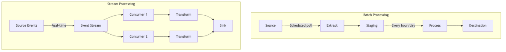

#### Batch

Run hourly or daily.

- **Pros**: simple, cost-efficient.
- **Cons**: latency, potential for large **backfills** (reprocessing historical data).

#### Streaming

Continuous event processing.

- **Pros**: low latency, incremental updates.
- **Cons**: more moving parts and operational complexity.

#### Advanced: streaming semantics and correctness
- Event design best practices
  - Envelope: event_id (UUID), event_time (RFC 3339), producer, source, schema_version, trace/span ids, partition_key; optional sequence for strict ordering.
  - Payload: immutable; additive evolution only; deprecate before removal; include idempotency_key if producer retries.
  - Contracts: register schema; validate at publish and consume; attach content-type and schema id.
  - Keys and partitions: choose business keys to preserve locality; avoid hot keys; consider hashing with salt.
- Time semantics: processing time (when you see it) vs event time (when it happened). Use event time for business-correct windows.
- Watermarking: a heuristic for “we’ve likely seen all events up to T”. Configure lateness (e.g., 5m) to balance correctness vs latency.
- Windows: tumbling (fixed), sliding (overlap), session (gaps). Late data: either update aggregates (retractions) or route to a correction topic.
- Delivery guarantees: at-least-once is common; achieve effectively-once with deterministic keys + idempotent sinks or transactional writes.
- Checkpointing & state: periodic checkpoints with exactly-once state backends (e.g., Flink) + externalized state (RocksDB). Ensure checkpoint + sink commits are atomic or compensatable.
- Partitioning: choose keys to avoid hotspots; rebalance when key skew emerges; use compacted topics for latest-state streams.
- Backpressure: monitor lag and processing time; apply rate-limits at sources or scale out consumers; use bounded buffers.
- Time semantics: processing time (when you see it) vs event time (when it happened). Use event time for business-correct windows.
- Watermarking: a heuristic for “we’ve likely seen all events up to T”. Configure lateness (e.g., 5m) to balance correctness vs latency.
- Windows: tumbling (fixed), sliding (overlap), session (gaps). Late data: either update aggregates (retractions) or route to a correction topic.
- Delivery guarantees: at-least-once is common; achieve effectively-once with deterministic keys + idempotent sinks or transactional writes.
- Checkpointing & state: periodic checkpoints with exactly-once state backends (e.g., Flink) + externalized state (RocksDB). Ensure checkpoint + sink commits are atomic or compensatable.
- Partitioning: choose keys to avoid hotspots; rebalance when key skew emerges; use compacted topics for latest-state streams.
- Backpressure: monitor lag and processing time; apply rate-limits at sources or scale out consumers; use bounded buffers.

Minimal Spark Structured Streaming example (event-time window + watermark)
```scala
import org.apache.spark.sql.functions._

val events = spark
  .readStream
  .format("kafka")
  .option("kafka.bootstrap.servers", "localhost:9092")
  .option("subscribe", "events")
  .load()

val parsed = events.selectExpr("CAST(value AS STRING)")
  .select(from_json(col("value"), schema).as("e"))
  .select(col("e.*")) // expects fields id, ts, amount

val agg = parsed
  .withWatermark("ts", "5 minutes")
  .groupBy(window(col("ts"), "15 minutes"))
  .agg(sum("amount").as("amount_15m"))

agg.writeStream.outputMode("update").format("console").start()
```

---

### CDC (Change Data Capture)

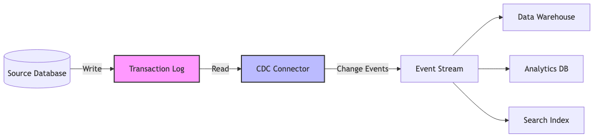

Reads database **change logs** (append-only records of row changes).

- **Pros**: near-real-time sync, avoids full scans.
- **Cons**: requires log access and careful **schema evolution** (changing schemas without breaking consumers).

**Learn more (summaries)**
- Debezium: open-source CDC connectors for MySQL/Postgres/SQL Server/Oracle; explains outbox patterns, schema evolution, and exactly-once considerations.
- Kafka Connect: distributed connector runtime with sink/source connectors, offset management, and REST management API; covers scalability and fault tolerance.

#### Advanced: CDC strategies and edge cases
- Snapshots: initial full snapshot modes (blocking vs incremental) and cutover plans; use high-water mark + change tables.
- Gaps and holes: handle missing LSN/SCN ranges; alert and re-snapshot affected partitions.
- Schema evolution: map breaking DB changes (type widen/narrow, rename, split/merge columns) to compatible event schemas; use semantic versions.
- Keys and updates: enforce stable primary keys; when keys change, emit tombstone + insert for compacted topics; downstream merges must handle updates vs deletes.
- Transaction boundaries: leverage source transaction metadata to ensure write atomicity at sinks (e.g., MERGE with commit timestamp ordering).
- Debezium specifics: outbox pattern, heartbeat topics, transaction metadata topics; tune snapshot.fetch.size, max.batch.size for stability.

---

### ODBC and direct database connections

Use ODBC/JDBC or native drivers to read from source databases when APIs/CDC are unavailable. Treat this as a controlled, read-only integration with pushdown filtering and strict governance.

Key practices
- Connectivity and security: TLS-encrypted connections; IP allowlists/VPN; read-only users scoped to specific schemas; least-privilege views.
- Performance: pushdown projection and predicates (SELECT only needed columns/rows); paginate with keyset pagination (WHERE id > last_id ORDER BY id) over LIMIT/OFFSET; tune fetch size.
- Consistency: prefer snapshot isolation (REPEATABLE READ/SNAPSHOT) for multi-page extracts; include high-water marks (updated_at, id) and resume tokens.
- Scheduling: incremental extracts by updated_at or change table when CDC is unavailable; backfill by ranges (date/id shards).
- Resiliency: retries with exponential backoff; connection pooling; statement timeouts and circuit breakers.
- Drivers: ODBC (cross-platform via DSN) vs JDBC (JVM-based); use vendor-supported drivers for SQL Server, Oracle, MySQL, Postgres, Snowflake, etc.
- Data types: normalize timezones (store UTC), decimals/scale, large text/BLOBs; explicitly cast to stable types at extraction.
- Governance: document queries, indices relied upon, and SLAs; monitor source impact (CPU, locks, long-running queries).

When to use
- Legacy/closed systems without APIs/CDC; reporting replicas allowed; low-to-moderate freshness requirements.
- Avoid for hot operational paths or when CDC is available (prefer CDC to minimize load and improve consistency).

---

### Webhooks vs polling

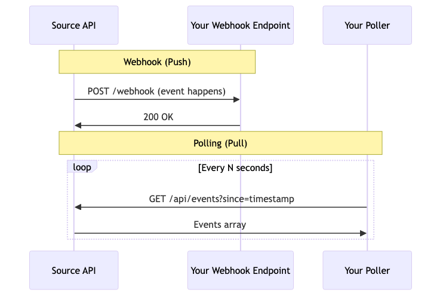

#### Webhook

Source sends HTTP POST to you on events.

- **Pros**: immediate updates.
- **Cons**: need public endpoints and **signature verification** (checking authenticity).

#### Polling

You fetch on a schedule.

- **Pros**: simpler networking.
- **Cons**: higher latency and risk of **rate limits** (limits on request frequency).

---

## Data transfer protocols (overview)

Choose protocols based on delivery guarantees, latency, payload size, device constraints, and partner capabilities.

- HTTP/HTTPS (REST)
  - Ubiquitous request/response APIs; cacheable GETs; pagination; retries with idempotency keys.
  - Use for: CRUD APIs, pull-based integrations, reverse ETL selects via API.
- GraphQL over HTTP
  - Flexible queries; single endpoint; schema/typing; watch N+1 patterns and limits.
  - Use for: tailored reads across multiple resources; when server supports persisted queries.
- Webhooks (HTTP push)
  - Source-initiated events; sign payloads; retry on 5xx; dedupe by event id.
  - Use for: near-real-time event notifications from SaaS/partners.
- gRPC (HTTP/2)
  - Strong typing via Protobuf; bi-di streaming; low latency.
  - Use for: internal services, high-throughput RPC, streaming transforms.
- WebSockets / Server-Sent Events (SSE)
  - Duplex (WS) or server→client (SSE) streams over a single connection.
  - Use for: dashboards, near-real-time feeds to clients; less common in B2B data ingestion.
- AMQP (0-9-1/1.0) — RabbitMQ, Azure Service Bus
  - Queues/topics, ack/requeue, dead-lettering; transactional semantics vary by impl.
  - Use for: command/event messaging with routing keys and backpressure.
- Kafka protocol — Apache Kafka, Redpanda, Event Hubs (Kafka endpoint)
  - Ordered partitions, durable log, consumer groups, replay; EOSv2 available.
  - Use for: streaming pipelines, CDC fan-out, multi-subscriber architectures.
- MQTT 3.1.1 / 5.0
  - Pub/sub for constrained IoT; QoS 0/1/2; retained messages; last will/testament.
  - Use for: device telemetry, edge→cloud gateways; bridge to Kafka for processing.
- NATS / JetStream
  - Lightweight pub/sub and KV/stream semantics; simple clients.
  - Use for: low-latency internal messaging where Kafka is heavy.
- CoAP
  - UDP-based for constrained devices; request/response and observe; DTLS.
  - Use for: sensor networks with tight bandwidth/energy constraints.
- SFTP/FTPS/SCP
  - Batch files over SSH/TLS; contracts on naming, checksums, PGP; atomic renames.
  - Use for: legacy and partner file exchanges.
- AS2 / EDI transport
  - Signed/encrypted B2B file exchange over HTTP with MDN receipts; common in retail.
  - Use for: EDI documents (X12/EDIFACT) when partners require AS2.
- OPC UA (OT)
  - Industrial telemetry/command; rich type system and browsing; secure channels.
  - Use for: plant/SCADA integrations, often bridged to MQTT/Kafka.

Security and reliability notes
- Always encrypt in transit (TLS/DTLS/SSH). Bind parameters for SQL-over-HTTP; verify webhook signatures.
- Apply backpressure: consumer groups, acks, flow control; use DLQs.
- Define idempotency and ordering: keys, sequence numbers, or event time + watermarks.

Decision guide (quick)
- Human-facing APIs → HTTP/REST/GraphQL.
- Streaming analytics/CDC → Kafka protocol.
- Device/edge → MQTT/OPC UA; bridge to Kafka.
- B2B files → SFTP/AS2; validate and land to bronze.
- Internal RPC → gRPC; batch jobs → HTTP + retry with backoff.

---

### Orchestrators and dataflow engines

#### Orchestrator

Schedules and tracks tasks: [Dagster](https://dagster.io/), [Prefect](https://www.prefect.io/), [Temporal](https://temporal.io/).

- **Pros**: visibility and retries.
- **Cons**: learning curve.

#### Dataflow engine

Executes transformations at scale: [Spark](https://spark.apache.org/), [Flink](https://flink.apache.org/).

- **Pros**: scalable compute.
- **Cons**: cluster and resource management.

---

## Legacy integration types: SFTP, batch files, flat files, EDI

Legacy integrations are still everywhere. Treat them with the same rigor: contracts, validation, idempotency, observability, and security.

Key patterns and guardrails
- SFTP (Secure File Transfer Protocol: encrypted file transfer over SSH)
  - Do: use key-based auth (authentication with SSH keys), IP allowlists, and chrooted users (restrict users to a directory).
  - Naming contract: include system, entity, date, sequence, and checksum, e.g. `acme_customers_2025-11-05_seq-00023_crc32-1A2B3C4D.csv`.
  - Atomic writes: upload to a temp name, then rename; avoid partial reads.
  - Idempotency: derive a content hash (e.g., SHA-256) or parse sequence numbers; store digests in a processed table to avoid re-ingest.
  - PGP (Pretty Good Privacy) encryption at rest: require `.gpg` files; decrypt server-side; validate signature (proves sender and integrity).
  - Retries: exponential backoff; quarantine (move to a safe folder) on repeated failures.
- Batch CSV/TSV (comma/tab-separated values)
  - Contract: provide a CSV schema (column names, types, formats, delimiters, newline style). Enforce via a validator before landing.
  - Common pitfalls: BOM (byte-order mark), stray delimiters, embedded newlines, inconsistent quoting. Normalize with a robust CSV parser.
  - Incremental loads: use high-water marks (max timestamp or ID) or explicit sequence files.
  - Deduplication: use natural keys + windowed dedupe (e.g., last 7 days) or content hashes.
- Fixed-width files (columns defined by start/end positions)
  - Contract: publish a layout spec (column offsets, types, padding). Reject rows with misaligned lengths.
  - Testing: create golden samples (known-good files) and fuzz tests (randomized variations) to catch parser drift.
- EDI (Electronic Data Interchange, e.g., X12 850/810, EDIFACT)
  - Use a translator (EDI parser/mapper) to convert to JSON/CSV.
  - Acknowledge via functional acknowledgments (997/999: confirmations of receipt and syntactic validity).
  - Idempotency: ISA/GS/ST control numbers (unique transaction identifiers) are your keys; track them.
- Email-driven drops
  - Avoid if possible. If required: use secure inboxes with strict allowlists; parse attachments; verify DKIM/SPF (email authentication mechanisms).

Control points and automations
- Landing zones (a.k.a. bronze): write-once, append-only, with metadata: `source`, `received_at`, `checksum`, `pgp_fingerprint`.
- Validation layers: schema checks, referential integrity (FKs between files), domain rules. Send detailed error reports to partners.
- Replay/backfill: keep raw files; reprocess deterministically for audits.
- Partner scorecards: track on-time delivery, error rates, file sizes, schema drift; share dashboards.

Mermaid diagram: SFTP batch intake
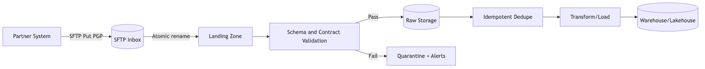

Operational checklist
- File contracts: add trailer records with record_count and control totals (e.g., sum of amounts) to detect truncation/corruption.
- Sequence and idempotency: enforce monotonically increasing sequence numbers per partner; reject duplicates; reconcile gaps before post.
- Rotate SSH keys regularly; enforce strong ciphers; disable password logins.
- Enforce file size limits; reject unexpected mime types; scan attachments for malware.
- Maintain a per-partner runbook (who to contact, SLAs, file contracts, escalation steps).
- Version contracts; run contract tests in CI with sample files.
- Emit metrics: files received, bytes, validation failures, dedupe drops, processing latency, partner SLA breaches.

### Practical examples: SFTP batch processing

#### TypeScript: SFTP + CSV validation

**Tools**: [ssh2-sftp-client](https://www.npmjs.com/package/ssh2-sftp-client) (SFTP), [csv-parse](https://csv.js.org/parse/) (CSV parser), [Zod](https://zod.dev/) (validation).

```typescript
import SFTPClient from "ssh2-sftp-client";
import { parse } from "csv-parse/sync";
import { z } from "zod";
import * as crypto from "node:crypto";
import * as fs from "node:fs/promises";

const CustomerRow = z.object({
  id: z.string(),
  name: z.string(),
  email: z.string().email(),
  created_date: z.string().regex(/^\d{4}-\d{2}-\d{2}$/)
});

type CustomerRow = z.infer<typeof CustomerRow>;

async function processSFTPBatch() {
  const sftp = new SFTPClient();
  await sftp.connect({
    host: "sftp.partner.com",
    privateKey: await fs.readFile("/secrets/sftp_key", "utf8"),
    username: "integration_user"
  });

  const files = await sftp.list("/inbox");
  
  for (const file of files.filter(f => f.name.endsWith(".csv"))) {
    const remotePath = `/inbox/${file.name}`;
    const localPath = `/tmp/${file.name}`;
    
    // Download atomically
    await sftp.get(remotePath, localPath);
    
    // Compute checksum for idempotency
    const content = await fs.readFile(localPath);
    const hash = crypto.createHash("sha256").update(content).digest("hex");
    
    // Check if already processed (pseudo-code)
    // if (await isProcessed(hash)) continue;
    
    // Parse and validate
    const records = parse(content, { columns: true, skip_empty_lines: true });
    const validated: CustomerRow[] = [];
    
    for (const rec of records) {
      const result = CustomerRow.safeParse(rec);
      if (result.success) {
        validated.push(result.data);
      } else {
        console.error("Validation failed:", result.error, rec);
      }
    }
    
    // Store with metadata
    await fs.writeFile(
      `/landing/${file.name}.json`,
      JSON.stringify({ hash, received_at: new Date().toISOString(), rows: validated }),
      "utf8"
    );
    
    // Archive original
    await sftp.rename(remotePath, `/archive/${file.name}`);
    
    console.log(`Processed ${file.name}: ${validated.length} rows, hash=${hash}`);
  }
  
  await sftp.end();
}

processSFTPBatch().catch(err => console.error(err));
```

**Pros**:
- Type-safe validation at runtime.
- Idempotency via content hash.
- Atomic operations (download, rename).

**Cons**:
- Single-threaded; scale horizontally for high volume.
- SSH key management requires external secrets store.

#### Python: SFTP + Pandas batch processing

**Tools**: [paramiko](https://www.paramiko.org/) (SSH/SFTP), [Pandas](https://pandas.pydata.org/) (CSV), [Pydantic](https://docs.pydantic.dev/) (validation).

```python
import hashlib
import paramiko
import pandas as pd
from pathlib import Path
from pydantic import BaseModel, EmailStr, ValidationError
from datetime import datetime

class CustomerRow(BaseModel):
    id: str
    name: str
    email: EmailStr
    created_date: str  # YYYY-MM-DD

def process_sftp_batch():
    key = paramiko.RSAKey.from_private_key_file("/secrets/sftp_key")
    transport = paramiko.Transport(("sftp.partner.com", 22))
    transport.connect(username="integration_user", pkey=key)
    sftp = paramiko.SFTPClient.from_transport(transport)
    
    for file_attr in sftp.listdir_attr("/inbox"):
        if not file_attr.filename.endswith(".csv"):
            continue
        
        remote_path = f"/inbox/{file_attr.filename}"
        local_path = f"/tmp/{file_attr.filename}"
        
        # Download
        sftp.get(remote_path, local_path)
        
        # Compute checksum
        with open(local_path, "rb") as f:
            file_hash = hashlib.sha256(f.read()).hexdigest()
        
        # Check idempotency (pseudo-code)
        # if is_processed(file_hash): continue
        
        # Parse CSV with Pandas
        df = pd.read_csv(local_path)
        validated = []
        
        for _, row in df.iterrows():
            try:
                customer = CustomerRow.model_validate(row.to_dict())
                validated.append(customer.model_dump())
            except ValidationError as e:
                print(f"Validation failed: {e}")
        
        # Store with metadata
        landing = {
            "hash": file_hash,
            "received_at": datetime.utcnow().isoformat(),
            "rows": validated
        }
        Path("/landing").mkdir(exist_ok=True)
        pd.DataFrame(landing["rows"]).to_parquet(
            f"/landing/{file_attr.filename}.parquet", index=False
        )
        
        # Archive
        sftp.rename(remote_path, f"/archive/{file_attr.filename}")
        
        print(f"Processed {file_attr.filename}: {len(validated)} rows, hash={file_hash}")
    
    sftp.close()
    transport.close()

if __name__ == "__main__":
    process_sftp_batch()
```

**Pros**:
- Pandas handles messy CSVs well; Parquet for fast analytics.
- Pydantic validates per-row with clear error messages.

**Cons**:
- Paramiko SSH setup is verbose; consider higher-level wrappers.
- Memory usage for large files; chunk with `chunksize` parameter.

#### Scala: SFTP + fs2 streaming

**Tools**: [sshj](https://github.com/hierynomus/sshj) (SFTP), [fs2](https://fs2.io/) (streaming), [Circe](https://circe.github.io/circe/) (JSON), [kantan.csv](https://nrinaudo.github.io/kantan.csv/) (CSV).

```scala
import cats.effect.{IO, IOApp}
import fs2.{Stream, io, text}
import net.schmizz.sshj.SSHClient
import net.schmizz.sshj.sftp.SFTPClient
import kantan.csv._
import kantan.csv.ops._
import java.security.MessageDigest

case class CustomerRow(id: String, name: String, email: String, createdDate: String)

object SFTPBatchProcessor extends IOApp.Simple {
  def computeSHA256(bytes: Array[Byte]): String =
    MessageDigest.getInstance("SHA-256")
      .digest(bytes)
      .map("%02x".format(_))
      .mkString

  def run: IO[Unit] = {
    val ssh = new SSHClient()
    ssh.loadKnownHosts()
    ssh.connect("sftp.partner.com")
    ssh.authPublickey("integration_user", "/secrets/sftp_key")
    val sftp = ssh.newSFTPClient()

    val files = sftp.ls("/inbox").asScala.filter(_.getName.endsWith(".csv"))

    Stream.emits(files.toSeq)
      .evalMap { file =>
        val remotePath = s"/inbox/${file.getName}"
        val localPath = s"/tmp/${file.getName}"

        for {
          _ <- IO(sftp.get(remotePath, localPath))
          bytes <- IO(java.nio.file.Files.readAllBytes(java.nio.file.Paths.get(localPath)))
          hash = computeSHA256(bytes)
          // Check idempotency: if (isProcessed(hash)) return
          rows <- IO {
            new String(bytes).asCsvReader[CustomerRow](rfc.withHeader)
              .collect { case Right(row) => row }
              .toList
          }
          _ <- IO.println(s"Processed ${file.getName}: ${rows.size} rows, hash=$hash")
          _ <- IO(sftp.rename(remotePath, s"/archive/${file.getName}"))
        } yield ()
      }
      .compile
      .drain
      .guarantee(IO(sftp.close()) >> IO(ssh.disconnect()))
  }
}
```

**Pros**:
- Purely functional with safe resource handling.
- Backpressure-aware streaming for large file sets.

**Cons**:
- SSHJ is Java-based; setup is verbose.
- CSV parsing with kantan.csv requires schema definition; less forgiving than Pandas.

**Learn more**: [ssh2-sftp-client](https://www.npmjs.com/package/ssh2-sftp-client), [paramiko docs](https://www.paramiko.org/), [sshj](https://github.com/hierynomus/sshj), [kantan.csv](https://nrinaudo.github.io/kantan.csv/).

## Enterprise integration scenarios (banking, payroll, PSP, ERP/HRIS)

This section outlines common enterprise integrations, with contracts, security, idempotency, pagination, and reconciliation patterns.

### Banking (accounts, payments, statements)
- Channels
  - Webhooks/API (events like payment posted, return received), SFTP statement files (ISO 20022 camt.053/camt.054, BAI2, OFX, CSV), portal downloads.
  - Payments: ACH (NACHA files for credits/debits), wires (Fedwire/ISO 20022 pacs.008/pacs.002), RTP (real-time payments) events.
- Contracts and identifiers
  - Use bank-provided unique references (trace number, end-to-end ID, payment ID) as idempotency keys; combine date + amount + counterparty as fallback.
  - For files, include naming contracts and checksums; require PGP encryption for SFTP.
- Reconciliation
  - Two-way: match internal ledger entries to bank transactions by reference and amount/date; handle timing differences (posting vs value date).
  - Returns and exceptions: ACH return codes (R01–R85), chargebacks, reversals; implement a state machine and retry/backoff policies.
- Security
  - mTLS/IP allowlists for APIs; PGP for files; signature verification for webhooks; strict secrets management.
  - Compliance: OFAC screening, audit logs, least privilege, separation of duties for approvals.
- Latency/SLAs
  - Intraday vs end-of-day statements; cut-off times; ensure idempotent backfills when late files arrive.

Mermaid: Bank events + statements
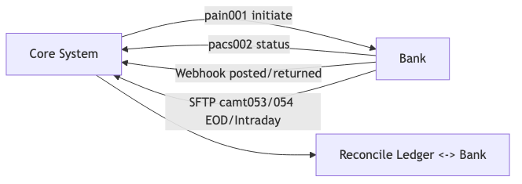

### Payroll (providers, HRIS, GL)
- Flows
  - Employee/HR data (HRIS: Workday, BambooHR), time & attendance, earnings/deductions, tax withholdings, payroll runs, GL exports.
  - Transports: SFTP CSV/fixed-width, provider APIs, webhooks for run status.
- Contracts
  - Versioned file specs (columns/offsets), schemas for API payloads; golden sample files; property-based tests for edge cases (overtime, bonuses, retro pay).
- PII/PHI handling
  - SSN, bank routing/account numbers, addresses: encrypt at rest, redact in logs, strict retention (need-to-know), DSRs (deletion/access) support.
- Idempotency & reconciliation
  - Run ID + pay period as idempotency keys; per-employee unique keys (employee_id + paycheck_date).
  - Reconcile totals (gross, net, taxes) against provider run reports; handle adjustments and reversals.
- Security & compliance
  - SOC 2/ISO attestations from providers; SFTP key rotation; audit trails; approvals workflow separation.

### PSP/Card processing (Stripe/Adyen-like), payouts
- Events: authorization, capture, refund, dispute/chargeback, payouts/settlements; fees and FX.
- Pattern: process webhooks for real-time events; reconcile with daily payout files over SFTP.
- Idempotency: provider event IDs + type; deterministically derive transfer IDs; dedupe on replay.
- Reconciliation: sum captured - refunds - fees = net payout; match by payout ID/date.

### ERP/Finance/CRM (master data and transactions)
- Master data sync
  - Parties/customers/vendors/products; use CDC where possible or API pagination by updated_at; cursors for large sets.
  - Contracts: strict schemas; reject unknowns, log schema drift.
- Transactions
  - Invoices, bills, journal entries; ensure double-entry integrity; batch windows with idempotent upserts.
- Security
  - OAuth/OIDC for APIs, mTLS for internal links, PGP for file exchanges; role-based access and environment scoping (dev/test/prod tenants).

Red flags and mitigations
- Unversioned file specs → introduce version field and publish samples; validate strictly.
- No unique identifiers → derive deterministic keys and keep a manifest for dedupe.
- Large late-arriving files → design for replay/backfill; partition by date and recompute safely.
- Partner outages → dead-letter queues, retry schedules, and clear runbooks with contacts.

## Industry-specific integrations: Public Utilities

Public utilities blend OT (operational technology: control systems) and IT (information technology: business systems). Integrations must respect safety, reliability, and regulatory constraints while delivering timely, trustworthy data.

### Electric generation and transmission (plants, ISO/RTO)
- Systems: SCADA/EMS (control/energy management), plant historians (OSIsoft/AVEVA PI), PMU synchrophasors, market/settlement systems (ISO/RTO), LMP pricing feeds.
- Protocols/standards: OPC UA, IEC 61850 (substation comms), DNP3 (telemetry/control), IEEE C37.118 (synchrophasors), MODBUS, MQTT Sparkplug B.
- Patterns: edge gateway normalizes tags → event backbone (Kafka/Redpanda) → stream processing (windowing, quality flags) → time-series store (ClickHouse/Timescale/Influx) and data lake.
- Data contracts: tag catalog (name, unit, scaling, limits), quality (good/bad/uncertain), sampling interval, timezone, asset hierarchy (CIM/IEC 61970 where applicable).
- Security/regulation: NERC CIP (critical infrastructure protection), network segmentation (OT/DMZ/IT), one-way data diodes where required, mTLS/IP allowlists, strict change control.
- SLAs: telemetry latency (e.g., p95 < 5s plant→control room), loss tolerance (no silent drops), replay/backfill from historian.

Python example: read an OPC UA tag and publish to Kafka (conceptual)
```python
from asyncua import Client  # OPC UA client
from confluent_kafka import Producer
import json, asyncio, os

OPC_ENDPOINT = os.getenv("OPC_ENDPOINT", "opc.tcp://plc1:4840")
KAFKA_BROKERS = os.getenv("KAFKA_BROKERS", "localhost:9092")
TAG_NODE = os.getenv("TAG_NODE", "ns=2;i=10853")  # example node id

def publish(p: Producer, topic: str, msg: dict):
    p.produce(topic, json.dumps(msg).encode("utf-8"))
    p.poll(0)

async def main():
    p = Producer({"bootstrap.servers": KAFKA_BROKERS})
    async with Client(url=OPC_ENDPOINT) as client:
        node = client.get_node(TAG_NODE)
        while True:
            val = await node.read_value()
            publish(p, "telemetry.plant1", {"node": TAG_NODE, "value": val})
            await asyncio.sleep(1)

if __name__ == "__main__":
    asyncio.run(main())
```

### Electric distribution (AMI, ADMS/DMS, OMS, GIS, MDMS, CIS)
- Systems: AMI head-end (smart meters), MDMS (meter data mgmt), ADMS/DMS (distribution mgmt), OMS (outage), GIS (Esri), WAMS, CIS/billing (SAP IS-U, Oracle CC&B), WAM/CMMS (Maximo).
- Transports: vendor APIs/webhooks, SFTP daily reads/outage files, CDC from CIS/ERP, message buses.
- Patterns: AMI intervals (15m/60m) → Kafka topic per service territory → streaming aggregations (billing cycles, TOU, demand) → MDMS/warehouse → CIS billing; outage events → OMS → notifications and crew dispatch.
- Contracts: meter identifier (ESN/MeterID/ServicePoint), interval schema (start, end, kWh/kW, quality), timezone and DST handling, estimator/substituter flags.
- Security: partner IP allowlists, PGP for files, privacy (household consumption), retention per regulation.

### Broadband (fiber/HFC, OSS/BSS)
- Systems: OSS (network inventory, provisioning), BSS (orders/billing), ACS (TR-069/TR-369 USP), RADIUS/AAA, DHCP/DNS, SDN controllers, NetOps (NMS), ticketing.
- Standards: TM Forum Open APIs (TMF 6xx series) for orders/inventory, TR-069/TR-369 for CPE mgmt, SNMP/gNMI/OpenConfig for telemetry, IPDR/NetFlow.
- Patterns: Order → Provision (inventory assign, device config) → Activate (RADIUS/AAA) → Monitor (telemetry to Kafka/TSDB) → Bill (usage CDRs) → Support (tickets).
- Mediation: normalize multi-vendor telemetry to a common schema; enrich with inventory and customer context.

### Water and wastewater
- Systems: SCADA (plants/pump stations), LIMS (lab results), CMMS (asset/work mgmt), GIS, CIS/billing, compliance reporting (e.g., EPA NetDMR).
- Protocols: OPC UA/MODBUS/DNP3 at the edge; SFTP/API for lab and compliance systems.
- Patterns: alarms/events to streaming with dedupe and escalation; daily lab results batch to warehouse and regulatory exports.
- Security: IEC 62443 (industrial security), segmentation, principle of least functionality on PLCs, strict patch/change windows.

Key cross-cutting controls for utilities
- Edge buffers and local store-and-forward to tolerate network gaps.
- Deterministic time handling (UTC internally; clear timezone on inputs; monotonic clocks for ordering).
- Backfill from historians/MDMS with idempotent merges.
- Dual-run validations when changing estimators/substituters or tariff models.

#### Advanced: utility-specific concerns
- Time alignment & DST: align AMI intervals to service-point local time; store canonical UTC with timezone for replays; handle DST fall-back overlaps deterministically.
- Estimation/substitution: document algorithms (last good value, linear interpolation, regression); version estimators and keep raw vs estimated flags.
- Power quality (PQ): capture harmonics, voltage sags/swells; maintain higher-frequency telemetry in separate topics/retention tiers.
- State estimation & topology: feed SCADA/GIS topology to estimators; keep model versions and ensure reproducibility across runs.
- Regulatory exports: generate audit-ready extracts (EIA/NetDMR/PUC) from curated layers; lock schemas and keep lineages.

#### Utilities diagrams

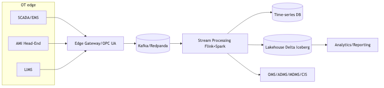

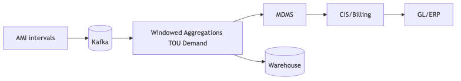

---

## Microsoft enterprise estate integrations

Leverage Azure-native services and Microsoft SaaS with first-class identity, private networking, and governed data flows.

Identity and access
- Microsoft Entra ID (Azure AD): App registrations, OAuth2 client credentials, RBAC; Managed Identities for compute (no static secrets).
- Microsoft Graph API: unified access to M365 (Users/Groups/Files/Teams); granular consent and least-privilege scopes.

Messaging and events
- Event Hubs (big telemetry streams, Kafka-compatible), Service Bus (ordered queues/topics, transactions), Event Grid (reactive, push-style routing), IoT Hub (device telemetry + DPS).
- Pattern: external webhooks → API Management → Functions/Logic Apps → Service Bus; high-throughput telemetry → Event Hubs → Stream processing → Lakehouse.

Data & ELT
- Storage: ADLS Gen2; Lakehouse: Synapse/Fabric; Compute: Databricks/Spark or Fabric notebooks; Orchestration: Azure Data Factory or Fabric Data Factory.
- CDC: SQL Server Change Tracking/Capture → ADF → Delta Lake; on-prem via Self-hosted Integration Runtime (IR).
- Governance: Microsoft Purview (catalog/classification/lineage); data products with domains.

Applications
- Dynamics 365 & Dataverse: use Web API and Change Tracking; Power Platform connectors for low-code integrations.
- SharePoint/OneDrive: Microsoft Graph and change notifications; large file upload sessions.
- Azure API Management: externalize partner APIs; policies for rate limits/JWT validation; Private Link for internal.

Networking & security
- Private Endpoints/Private Link and VNet integration for Functions, ADF, Storage, Synapse; disable public network access.
- Secrets in Key Vault; Defender for Cloud and Sentinel (SIEM) for detection; Azure Policy for guardrails; PIM for just-in-time privileged access.

TypeScript example: Service Bus queue consumer
```ts
import { ServiceBusClient } from "@azure/service-bus";

const connectionString = process.env.SB_CONNECTION_STRING!; // store in Key Vault
const queueName = process.env.SB_QUEUE_NAME!;

const sb = new ServiceBusClient(connectionString);
const receiver = sb.createReceiver(queueName);

receiver.subscribe({
  async processMessage(msg) {
    // Idempotency: use msg.messageId as key
    console.log("Message:", msg.body);
  },
  async processError(err) {
    console.error("SB error", err);
  }
});
```

Python example: Event Hubs ingestion
```python
from azure.eventhub import EventHubConsumerClient
import os

conn_str = os.environ["EH_CONN_STR"]  # Key Vault-backed
consumer_group = "$Default"
fully_qualified_namespace = os.environ["EH_FQNS"]  # e.g., myns.servicebus.windows.net
hub_name = os.environ["EH_NAME"]

client = EventHubConsumerClient.from_connection_string(
    conn_str=conn_str, consumer_group=consumer_group, eventhub_name=hub_name
)

def on_event(partition_context, event):
    print("Event:", event.body_as_str())
    partition_context.update_checkpoint(event)

with client:
    client.receive(on_event=on_event, starting_position="-1")
```

Scala note: Event Hubs has a Kafka endpoint; use standard Kafka clients with SASL/SSL to consume/produce (topic = Event Hub name). Treat connection secrets as managed credentials.

Operational guardrails (Azure)
- Use Managed Identities wherever possible (Functions/Databricks/Synapse) and Key Vault references for secrets.
- Lock down Storage/Databricks/Synapse with Private Endpoints; route through Azure Firewall.
- Purview scans for classification/lineage; enforce schema compatibility in CI for Delta tables.
- Tag resources (owner, data-domain, sensitivity); automate cost and drift alerts.

#### Advanced: Microsoft estate patterns
- Graph delta queries & change notifications: consume differential feeds to avoid full scans; persist delta tokens securely.
- Entra ID token caching: use Managed Identity/On-behalf-of flows; cache tokens with expiry and audience checks.
- Event Hubs/Kafka tuning: choose partition keys, throughput units/processing units sizing, capture to ADLS for replay; consumer group isolation.
- ADF Integration Runtime: self-hosted IR for on-prem; tune copy vs Mapping Data Flows; staged copy via ADLS for large DB loads.
- Synapse/Fabric: serverless vs dedicated; Delta Lake features (Change Data Feed, OPTIMIZE/ZORDER in Databricks) and governance with Purview.

#### Microsoft/Azure diagrams

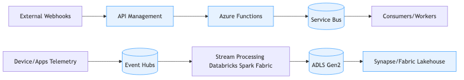

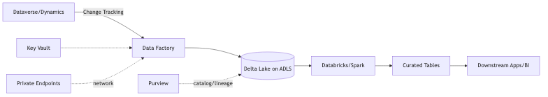

---

## Reference blueprint (conceptual)

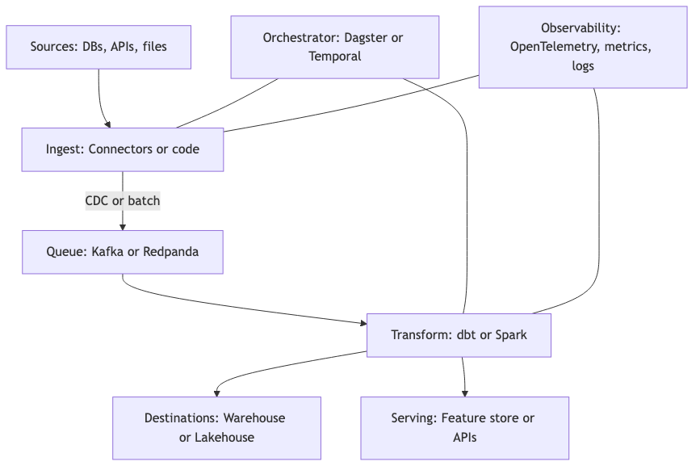

---

## Stack recipes with short examples

### TypeScript recipe: validate, transform, and write safely

**Tools**: [Zod](https://zod.dev/) (schema validation), [fp-ts](https://gcanti.github.io/fp-ts/) (functional utilities), node fetch or axios (HTTP client).

**Example**: validate an API record, transform it, and write to disk. Idempotency here is demonstrated by deriving a stable filename from a natural key so reruns overwrite the same file.

```typescript
import { z } from "zod";
import { pipe } from "fp-ts/function";
import * as E from "fp-ts/Either";
import * as fs from "node:fs/promises";

const User = z.object({
  id: z.string(),
  email: z.string().email(),
  createdAt: z.string() // ISO timestamp
});

type User = z.infer<typeof User>;

const transformUser = (u: User) => ({
  id: u.id,
  email_domain: u.email.split("@")[1],
  created_date: u.createdAt.split("T")[0]
});

const parseUser = (data: unknown) =>
  E.tryCatch(
    () => User.parse(data),
    e => new Error(String(e))
  );

async function main() {
  const res = await fetch("https://example.com/api/user/123");
  const json = await res.json();

  const result = parseUser(json);
  if (E.isRight(result)) {
    const safe = transformUser(result.right);
    const outPath = `./out/user-${safe.id}.json`;
    await fs.mkdir("./out", { recursive: true });
    await fs.writeFile(outPath, JSON.stringify(safe) + "\n", "utf8");
    console.log("Wrote", outPath);
  } else {
    console.error("Validation failed", result.left.message);
  }
}

main().catch(err => console.error(err));
```

#### Pros

- Strong types and runtime validation reduce bad data.
- Composable pure functions make logic easy to test.

#### Cons

- Node-based pipelines may need extra tooling for heavy compute.
- Requires discipline to separate pure logic from I/O.

**Learn more**: [Zod](https://zod.dev/), [fp-ts](https://gcanti.github.io/fp-ts/), [KafkaJS](https://kafka.js.org/), [Temporal TypeScript SDK](https://docs.temporal.io/typescript), [dbt Core](https://docs.getdbt.com/).

---

### Python recipe: ingest, validate, and batch to Parquet

**Tools**: [Pydantic](https://docs.pydantic.dev/) (validation), [Requests](https://requests.readthedocs.io/) (HTTP), [Pandas](https://pandas.pydata.org/) (tabular data), [PyArrow Parquet](https://arrow.apache.org/docs/python/parquet.html) (columnar file format optimized for analytics).

**Example**: fetch, validate, transform, and save as Parquet.

```python
from datetime import datetime
from typing import List
import requests
import pandas as pd
from pydantic import BaseModel, EmailStr, ValidationError

class User(BaseModel):
    id: str
    email: EmailStr
    created_at: datetime

def transform(u: User) -> dict:
    return {
        "id": u.id,
        "email_domain": u.email.split("@")[1],
        "created_date": u.created_at.date().isoformat(),
    }

def run():
    r = requests.get("https://example.com/api/users")
    r.raise_for_status()
    raw = r.json()
    out: List[dict] = []
    for item in raw:
        try:
            u = User.model_validate(item)
            out.append(transform(u))
        except ValidationError as e:
            print("Validation failed:", e)

    df = pd.DataFrame(out)
    df.to_parquet("out/users.parquet", index=False)

if __name__ == "__main__":
    run()
```

#### Pros

- Rich ecosystem for data work (Pandas, PyArrow, Dagster, Prefect, dbt).
- Pydantic makes validation straightforward.

#### Cons

- Performance tuning may be needed for very large datasets.
- Virtual environment and version management require care.

**Learn more**: [Pydantic](https://docs.pydantic.dev/), [Dagster](https://dagster.io/), [Prefect](https://www.prefect.io/), [Great Expectations](https://greatexpectations.io/), [dbt Core](https://docs.getdbt.com/).

---

### Scala recipe: functional streaming with fs2 and Circe

**Tools**: [cats-effect](https://typelevel.org/cats-effect/) (FP effects), [fs2](https://fs2.io/) (functional streams), [Circe](https://circe.github.io/circe/) (JSON), [Spark](https://spark.apache.org/) for big data transforms.

**Example**: decode and transform a small JSON stream.

```scala
import cats.effect.{IO, IOApp}
import fs2.Stream
import io.circe._, io.circe.parser._

final case class User(id: String, email: String, createdAt: String)

object Main extends IOApp.Simple {
  def transform(u: User): Map[String, String] =
    Map(
      "id" -> u.id,
      "email_domain" -> u.email.split("@")(1),
      "created_date" -> u.createdAt.takeWhile(_ != 'T')
    )

  val rawJson = List(
    """{"id":"1","email":"a@example.com","createdAt":"2024-01-01T12:00:00Z"}"""
  )

  def run: IO[Unit] =
    Stream
      .emits(rawJson)
      .evalMap { s =>
        IO.fromEither(decode[User](s)).attempt.flatMap {
          case Right(u) => IO.println(transform(u))
          case Left(e)  => IO.println(s"Validation failed: ${e.getMessage}")
        }
      }
      .compile
      .drain
}
```

#### Pros

- Strong FP abstractions enable safe, composable pipelines.
- Excellent for streaming and backpressure-aware processing.

#### Cons

- Steeper learning curve for FP libraries.
- Spark integration adds operational overhead.

**Learn more**: [cats-effect](https://typelevel.org/cats-effect/), [fs2](https://fs2.io/), [Circe](https://circe.github.io/circe/), [Spark Structured Streaming](https://spark.apache.org/docs/latest/structured-streaming-programming-guide.html).

---

## Data quality and data contracts

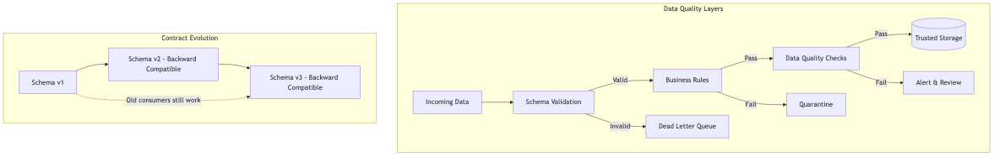

### Expectations

**Expectations** (machine-checked assertions about data): e.g., **column not null** (no missing values) or **values in a set** (only allowed values).

**Example with Great Expectations** ([Python data quality framework](https://greatexpectations.io/)):

```python
import pandas as pd
from great_expectations.dataset import PandasDataset

df = pd.DataFrame({"id":[1,2], "email":["a@example.com","b@example.com"]})
gdf = PandasDataset(df)
gdf.expect_column_values_to_not_be_null("id")
gdf.expect_column_values_to_match_regex("email", r".+@.+")
result = gdf.validate()
print(result["success"])
```

### Schema evolution

Version schemas and use **backward compatibility** (new data still works with old consumers). Keep a **changelog** (record of changes).

**Learn more**: [Schema Registry docs](https://docs.confluent.io/platform/current/schema-registry/index.html), [Avro schema evolution](https://avro.apache.org/docs/current/spec.html#Schema+Resolution).

---

## Testing strategies

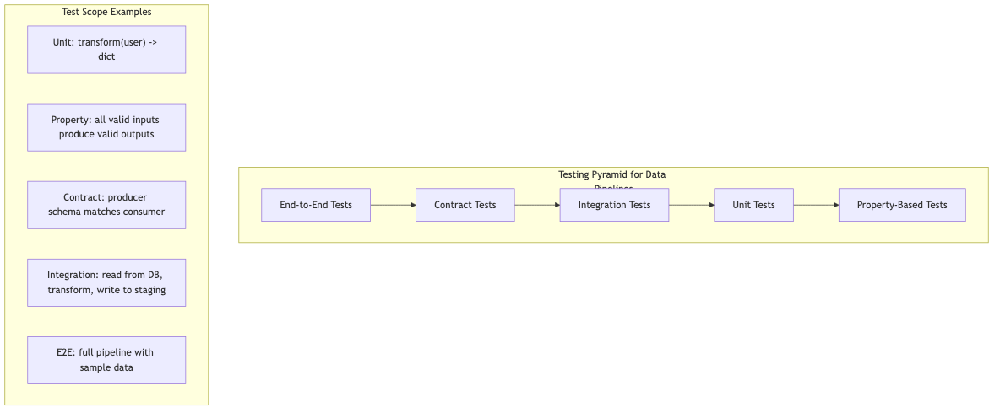

- **Unit tests** (test individual functions) on pure transforms.
- **Property-based tests** (generate varied inputs to test general properties).
- **Contract tests** (verify producer and consumer agree on schema and fields).
- **End-to-end tests** (run the entire pipeline on a small sample).

**Tools**: [fast-check](https://fast-check.dev/) (TypeScript), [Hypothesis](https://hypothesis.readthedocs.io/) (Python), [ScalaCheck](https://scalacheck.org/) (Scala).

#### Advanced: testing data systems
- Contract testing in CI: verify schema compatibility (backward/full) against registry; run consumer-driven contract tests before deploy.
- Differential testing: run old vs new models on the same sample and compare aggregates/distributions (tolerances per metric).
- Property-based tests for transforms: invariants like conservation of sums, monotonic counters, idempotent merges.
- Golden datasets: curated edge-case corpora (DST boundaries, nulls, Unicode, large numbers) for regressions; store under version control.
- End-to-end with time travel: in ACID tables, test replay/backfill correctness by rewinding snapshots and re-applying jobs.

---

## Observability basics

Data observability checks (additive to app telemetry)
- Freshness: max(age(now, max(event_time|updated_at))) per table/partition; alert on SLO burn.
- Volume: records per interval vs baseline; change point detection; alert on drops/spikes.
- Schema: drift detection (new/removed/renamed fields); block breaking changes at ingress.
- Quality: null-rate thresholds, unique constraints, value range checks; publish pass/fail as metrics.
- Lineage: emit dataset in/out and code version/build SHA for each job; tie runs to commits and configurations.
- Tools: Great Expectations/Soda, Monte Carlo/Bigeye (managed), OpenLineage + collector to catalog.

### Logging and data persistence rules

- Do not log raw PII (personally identifiable information). Redact or hash with a keyed HMAC if correlation is required; never log secrets, API keys, access tokens, private keys, or full card numbers.
- Use structured logs (JSON) with stable keys; include correlation IDs (unique request identifiers) and partner/source identifiers; avoid dumping entire payloads.
- Adopt log levels: DEBUG (dev-only, feature-flagged), INFO (high-level flow), WARN (recoverable anomalies), ERROR (actionable failures). Guard DEBUG in production.
- Set retention policies by data class: e.g., 7–14 days for detailed app logs, 30–90 days for audit logs; longer only if legally required.
- Implement sampling for high-volume success logs; never sample error logs. Ensure sampling decisions preserve traceability.
- Centralize logs in a secure store; restrict access by least privilege; enable immutability/legal holds for audit streams.
- Add data lineage/context fields instead of content: file_name, checksum, record_count, schema_version, received_at.

### Idempotency and pagination rules

Idempotency store patterns
- Hash strategy: compute SHA-256 over stable request fields; store hash → result with TTL in Redis/DB; upsert on success only.
- Bloom filter assist: for ultra-high volume, combine a Redis Bloom filter for fast probable-exists with a durable dedupe table.
- TTL policy: retain keys through the maximum retry/replay window (commonly 24–72h); leak-test memory; purge via time-indexed keys.
- Provenance: store job_id/run_id and source file/event metadata to trace how results were produced.

Idempotency (safe to retry without changing the final result)
- All ingestion endpoints and batch jobs must be idempotent. Use idempotency keys (deterministically derived identifiers) or natural keys + upsert semantics.
- For file-based intake, compute content digests (e.g., SHA-256) and persist a processed manifest; on retry, skip duplicates.
- For APIs, require headers like `Idempotency-Key` and store request hashes + result hashes for the retry window (e.g., 24–72 hours).
- Avoid non-deterministic operations inside idempotent handlers (e.g., "now" timestamps without passing them as inputs); if needed, pass a fixed clock or include timestamps in the key.

Pagination (consistent traversal of large datasets)
- Prefer cursor-based pagination (an opaque token representing position) over offset-based pagination for consistency and performance.
- For "delta" backfills, paginate by a stable sort key (e.g., updated_at, id) and use ">= last_seen" semantics to avoid gaps; dedupe on the consumer side.
- Enforce maximum page sizes; document rate limits; backoff on 429/503 responses; support resume on failure with the last cursor.
- When combining pagination with idempotency, include the page cursor or last-seen checkpoint in the idempotency key so retries don't create duplicates.

#### Practical examples: idempotency and pagination

##### TypeScript: idempotent API handler with request tracking

```typescript
import { createHash } from "node:crypto";
import { Request, Response } from "express";

// Pseudo-store for demo; use Redis or DB in production
const requestCache = new Map<string, { status: number; body: any }>();
const TTL_MS = 24 * 60 * 60 * 1000; // 24 hours

function computeIdempotencyKey(req: Request): string {
  const key = req.headers["idempotency-key"] as string;
  if (key) return key;
  
  // Fallback: hash method + path + body
  const hash = createHash("sha256")
    .update(`${req.method}:${req.path}:${JSON.stringify(req.body)}`)
    .digest("hex");
  return hash;
}

export async function idempotentHandler(req: Request, res: Response) {
  const idempotencyKey = computeIdempotencyKey(req);
  
  // Check cache
  if (requestCache.has(idempotencyKey)) {
    const cached = requestCache.get(idempotencyKey)!;
    return res.status(cached.status).json(cached.body);
  }
  
  // Process request
  try {
    const result = await processRequest(req.body);
    const response = { status: 200, body: result };
    
    // Cache result with TTL
    requestCache.set(idempotencyKey, response);
    setTimeout(() => requestCache.delete(idempotencyKey), TTL_MS);
    
    res.status(200).json(result);
  } catch (err) {
    // Don't cache errors; allow retry
    console.error("Request failed:", err);
    res.status(500).json({ error: "Internal error" });
  }
}

async function processRequest(body: any): Promise<any> {
  // Your business logic here
  return { id: "123", status: "processed" };
}
```

**Key points**:
- Idempotency key from header or derived from request content.
- Cache successful responses for 24 hours; don't cache errors.
- Replay cached response immediately on duplicate.

##### Python: cursor-based pagination with resumable polling

```python
import requests
import time
from typing import Optional, List, Dict, Any

BASE_URL = "https://api.partner.com/v1/customers"
MAX_RETRIES = 3
BACKOFF_SECONDS = 2

def fetch_all_customers() -> List[Dict[str, Any]]:
    """Fetch all customers using cursor-based pagination."""
    all_customers = []
    cursor: Optional[str] = None
    
    while True:
        customers, next_cursor = fetch_page(cursor)
        all_customers.extend(customers)
        
        if not next_cursor:
            break  # No more pages
        
        cursor = next_cursor
        time.sleep(0.1)  # Rate limit courtesy
    
    return all_customers

def fetch_page(cursor: Optional[str], retry: int = 0) -> tuple[List[Dict], Optional[str]]:
    """Fetch a single page; returns (records, next_cursor)."""
    params = {"limit": 100}
    if cursor:
        params["cursor"] = cursor
    
    try:
        resp = requests.get(BASE_URL, params=params, timeout=10)
        resp.raise_for_status()
        data = resp.json()
        
        return data.get("customers", []), data.get("next_cursor")
    
    except (requests.HTTPError, requests.Timeout) as e:
        if retry < MAX_RETRIES:
            wait = BACKOFF_SECONDS * (2 ** retry)
            print(f"Error fetching page, retry {retry + 1}/{MAX_RETRIES} in {wait}s")
            time.sleep(wait)
            return fetch_page(cursor, retry + 1)
        raise

if __name__ == "__main__":
    customers = fetch_all_customers()
    print(f"Fetched {len(customers)} customers")
```

**Key points**:
- Cursor is opaque; passed to next request.
- Exponential backoff on transient errors.
- Resumable: if process crashes, restart with last known cursor.

##### Scala: idempotent file processing with manifest

```scala
import cats.effect.{IO, Ref}
import java.security.MessageDigest
import scala.collection.mutable

case class ProcessedManifest(hashes: Set[String])

object IdempotentFileProcessor {
  def computeSHA256(bytes: Array[Byte]): String =
    MessageDigest.getInstance("SHA-256")
      .digest(bytes)
      .map("%02x".format(_))
      .mkString

  def processFile(filePath: String, manifestRef: Ref[IO, ProcessedManifest]): IO[Unit] =
    for {
      bytes <- IO(java.nio.file.Files.readAllBytes(java.nio.file.Paths.get(filePath)))
      hash = computeSHA256(bytes)
      manifest <- manifestRef.get
      
      _ <- if (manifest.hashes.contains(hash)) {
        IO.println(s"File $filePath already processed (hash=$hash), skipping")
      } else {
        for {
          _ <- IO.println(s"Processing $filePath (hash=$hash)")
          _ <- doProcessing(bytes)
          _ <- manifestRef.update(m => m.copy(hashes = m.hashes + hash))
        } yield ()
      }
    } yield ()

  def doProcessing(bytes: Array[Byte]): IO[Unit] =
    IO.println(s"Processing ${bytes.length} bytes...")

  def run: IO[Unit] = {
    val files = List("/data/file1.csv", "/data/file2.csv")
    
    Ref.of[IO, ProcessedManifest](ProcessedManifest(Set.empty)).flatMap { manifestRef =>
      files.traverse_(file => processFile(file, manifestRef))
    }
  }
}
```

**Key points**:
- SHA-256 digest as idempotency key.
- Manifest (in-memory here; persist to DB/file in production).
- Safe to re-run; duplicate hashes skipped.

#### Logging best practices example

```typescript
import pino from "pino";

const logger = pino({
  redact: {
    paths: [
      "req.headers.authorization",
      "req.body.password",
      "req.body.ssn",
      "req.body.credit_card",
      "*.email"  // Redact all email fields
    ],
    censor: "[REDACTED]"
  },
  level: process.env.LOG_LEVEL || "info"
});

function logIncomingFile(fileName: string, checksum: string, recordCount: number) {
  logger.info({
    event: "file_received",
    file_name: fileName,
    checksum,
    record_count: recordCount,
    partner: "acme_corp",
    received_at: new Date().toISOString()
  }, "File received for processing");
}

function logError(err: Error, context: Record<string, any>) {
  logger.error({
    event: "processing_error",
    error: err.message,
    stack: err.stack,
    ...context
  }, "Processing failed");
}

// Usage
logIncomingFile("customers_2025-11-05.csv", "abc123...", 1024);
logError(new Error("Invalid schema"), { file_name: "bad.csv", row: 42 });
```

**Key points**:
- Automatic PII redaction via path specs.
- Structured fields for easy querying.
- No raw payload dumps; only metadata.

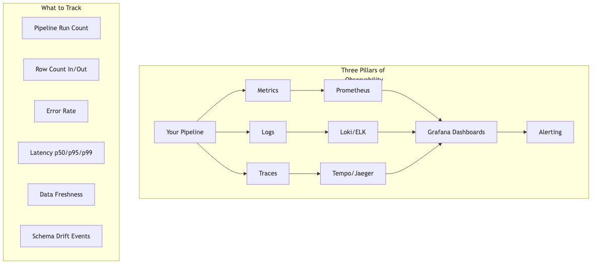

- **Metrics**: counts, rates, latencies.
- **Logs**: structured JSON logs for easy search.
- **Traces**: end-to-end timing and context across services using [OpenTelemetry](https://opentelemetry.io/).

**Learn more (summaries)**
- OpenTelemetry docs: vendor-neutral APIs/SDKs for traces, metrics, logs; how to instrument services and export to backends.
- Prometheus: pull-based metrics with PromQL; docs cover counters/gauges/histograms, recording rules, and alerting.
- Grafana: dashboards/alerts over Prometheus, Loki, Tempo; guides on building effective SLO and troubleshooting panels.
- Google Cloud Logging redaction: field-level redaction and sinks to prevent sensitive data exposure; patterns transferable to other log stacks.
- Stripe Idempotency Keys: request-key semantics, replay behavior, and storage strategy—good blueprint for your APIs.
- RFC 8288 pagination (Link headers) and related guidance: standard HTTP pagination links (next, prev) and best practices for robust clients.

---

## Security and governance

Warehouse access control patterns
- Row-Level Security (RLS): policy-based filters per tenant/entity; bind to identity (service principal, user) and roles.
- Column-level security/masking: restrict PII columns; dynamic data masking for dev/test; tokenize sensitive identifiers.
- Per-tenant keys: envelope encrypt columns with per-tenant keys (BYOK/HYOK where required); rotate and audit.
- Auditing: enable object-level logging; alert on privilege escalations and policy changes; least-privilege review cadence.

### Integration security best practices (deep dive)

Defense-in-depth for data integrations means layering controls across identity, transport, data, runtime, and operations. Below is a concise, actionable checklist with definitions.

Identity and access management (IAM)
- Least privilege (grant only the minimal permissions needed) for service accounts; separate read vs write roles per source/sink.
- Short-lived credentials (secrets that expire quickly) via OIDC (OpenID Connect: identity layer on top of OAuth 2.0) or STS (Security Token Service) where supported.
- Rotate keys (change them regularly) and enforce MFA (multi-factor authentication) for human access; disable password auth for SFTP/SSH.
- Use workload identity (binding an app’s identity to its runtime, e.g., Kubernetes ServiceAccount to cloud IAM) to avoid static keys.

Secrets management
- Store secrets in a vault (specialized secure storage) like HashiCorp Vault or a cloud secrets manager; never in code or config files.
- Use envelope encryption (secrets encrypted with a data key, which is encrypted by a master key) and audit reads of secrets.
- Inject secrets at runtime via environment variables or files with least privilege; avoid printing secrets in logs.

Network and transport
- Enforce TLS (Transport Layer Security) for all HTTP/gRPC; pin certificates (validate the server’s certificate or CA bundle).
- Mutual TLS (mTLS: both client and server present certificates) for sensitive partner links or internal services.
- Private connectivity (VPC peering, PrivateLink-style) where possible; restrict egress (outbound network) to allowlisted hosts.
- IP allowlists for SFTP/SSH and webhook sources; rate-limit endpoints to mitigate abuse.

Data at rest and in use
- Encrypt at rest (disk/database encryption) using managed KMS (Key Management Service) keys with rotation.
- Field-level protection for PII (masking, tokenization, or format-preserving encryption) in logs, staging, and warehouses.
- Minimize data collection (data minimization) and retain only as long as needed (retention policies).
- Hashing for idempotency (e.g., SHA-256) should not reuse raw PII as salts (random inputs to hashing); use constant-time comparisons where appropriate.

Application layer and inputs
- Validate inputs at the edge with schemas; reject on failure and quarantine samples for debugging.
- Canonicalize file formats (normalize newlines, encodings) to avoid parser evasion.
- For webhooks, verify signatures (HMAC: hash-based message authentication) and timestamps; replay-protect with idempotency keys.
- For EDI, verify control numbers and envelopes; require 997/999 acknowledgments.

Runtime hardening
- Run containers as non-root; use read-only root filesystems; drop Linux capabilities not needed.
- Apply seccomp/AppArmor (Linux kernel sandboxing) or equivalent; keep images minimal and scanned for CVEs (known vulnerabilities).
- Use policy agents (e.g., OPA: Open Policy Agent) for admission controls and data egress rules.

Observability and detection
- Structured audit logs (who did what, when, where) for data reads/writes, schema changes, and policy decisions.
- Security telemetry (metrics and traces) for auth failures, signature mismatches, schema drift, and unusual data volumes.
- Alerts with runbooks (clear steps to respond) and automatic quarantine on repeated failures.

Compliance and governance
- Data classification (tag by sensitivity: public/internal/confidential/restricted) drives masking and access policies.
- DSRs (Data Subject Requests) support: track data lineage to fulfill deletion/access requests (GDPR/CCPA).
- DPIAs (Data Protection Impact Assessments) for high-risk integrations; document residual risks and mitigations.

Partner and third-party risk
- Contractual SLAs (service level agreements) for timeliness, availability, and schema change notice.
- Security addenda (controls, breach notification windows), SOC 2/ISO 27001 reports, and penetration testing attestations.
- Onboarding/offboarding checklists: access provisioning, test file exchange, key rotation schedule, emergency contacts.

Change management and break-glass
- Blue/green or canary deployments (release to a subset first) for adapters; rollback automation.
- Break-glass access (emergency elevated access) with strong approvals, time limits, and full audit.
- Versioned data contracts with backward compatibility checks in CI.

#### Security layers diagram


#### Practical examples: webhook signature verification

Always verify webhook signatures before processing to ensure authenticity (message came from the claimed sender) and integrity (message was not tampered with).

##### TypeScript: HMAC webhook verification

```typescript
import * as crypto from "node:crypto";
import { Request, Response } from "express";

const WEBHOOK_SECRET = process.env.WEBHOOK_SECRET!;
const MAX_AGE_SECONDS = 300; // 5 minutes

function verifyWebhook(req: Request): boolean {
  const signature = req.headers["x-webhook-signature"] as string;
  const timestamp = req.headers["x-webhook-timestamp"] as string;
  
  if (!signature || !timestamp) {
    return false;
  }
  
  // Replay protection: reject old messages
  const age = Date.now() / 1000 - parseInt(timestamp, 10);
  if (Math.abs(age) > MAX_AGE_SECONDS) {
    console.warn("Webhook too old or future-dated");
    return false;
  }
  
  // Compute expected signature
  const payload = timestamp + "." + JSON.stringify(req.body);
  const expected = crypto
    .createHmac("sha256", WEBHOOK_SECRET)
    .update(payload, "utf8")
    .digest("hex");
  
  // Constant-time comparison to prevent timing attacks
  return crypto.timingSafeEqual(
    Buffer.from(signature, "hex"),
    Buffer.from(expected, "hex")
  );
}

export function handleWebhook(req: Request, res: Response) {
  if (!verifyWebhook(req)) {
    res.status(401).send("Unauthorized");
    return;
  }
  
  // Process webhook payload
  console.log("Valid webhook:", req.body);
  res.status(200).send("OK");
}
```

**Security properties**:
- HMAC prevents tampering and proves sender knows the secret.
- Timestamp + age check prevents replay attacks.
- `timingSafeEqual` prevents timing side-channels.

##### Python: webhook signature with constant-time compare

```python
import hashlib
import hmac
import time
from flask import Flask, request, abort

WEBHOOK_SECRET = os.environ["WEBHOOK_SECRET"].encode("utf8")
MAX_AGE_SECONDS = 300

app = Flask(__name__)

def verify_webhook(request) -> bool:
    signature = request.headers.get("X-Webhook-Signature")
    timestamp = request.headers.get("X-Webhook-Timestamp")
    
    if not signature or not timestamp:
        return False
    
    # Replay protection
    age = abs(time.time() - int(timestamp))
    if age > MAX_AGE_SECONDS:
        print("Webhook too old")
        return False
    
    # Compute expected signature
    payload = f"{timestamp}.{request.get_data(as_text=True)}"
    expected = hmac.new(
        WEBHOOK_SECRET,
        payload.encode("utf8"),
        hashlib.sha256
    ).hexdigest()
    
    # Constant-time comparison
    return hmac.compare_digest(signature, expected)

@app.route("/webhook", methods=["POST"])
def handle_webhook():
    if not verify_webhook(request):
        abort(401, "Unauthorized")
    
    # Process webhook
    print("Valid webhook:", request.json)
    return "OK", 200
```

**Security properties**:
- `hmac.compare_digest` is constant-time and safe against timing attacks.
- Age check defends against replay.
- Signature covers both timestamp and body.

##### Scala: HMAC verification with cats-effect

```scala
import cats.effect.IO
import javax.crypto.Mac
import javax.crypto.spec.SecretKeySpec
import java.security.MessageDigest
import scala.concurrent.duration._

object WebhookVerifier {
  val secret: Array[Byte] = sys.env("WEBHOOK_SECRET").getBytes("UTF-8")
  val maxAge: FiniteDuration = 5.minutes

  def verifySignature(signature: String, timestamp: Long, body: String): IO[Boolean] = IO {
    val age = Math.abs(System.currentTimeMillis() / 1000 - timestamp)
    if (age > maxAge.toSeconds) {
      return IO.pure(false)
    }

    val payload = s"$timestamp.$body"
    val mac = Mac.getInstance("HmacSHA256")
    mac.init(new SecretKeySpec(secret, "HmacSHA256"))
    val expected = mac.doFinal(payload.getBytes("UTF-8"))
      .map("%02x".format(_))
      .mkString

    // Constant-time compare
    MessageDigest.isEqual(signature.getBytes, expected.getBytes)
  }

  def handleWebhook(signature: String, timestamp: Long, body: String): IO[Unit] =
    verifySignature(signature, timestamp, body).flatMap {
      case true => IO.println(s"Valid webhook: $body")
      case false => IO.raiseError(new Exception("Unauthorized"))
    }
}
```

**Security properties**:
- `MessageDigest.isEqual` is constant-time in the JVM.
- Covers timestamp and body.
- Age check prevents replay.

#### Additional hardening patterns

- **API key rotation**: issue time-limited keys; revoke on compromise; store hashes, not plaintext.
- **Certificate pinning**: hardcode or allowlist expected CA/cert fingerprints; reject mismatches.
- **Egress filtering**: use a proxy or firewall to allow only known destination IPs/domains.
- **Data loss prevention (DLP)**: scan outbound data for patterns (SSNs, credit cards) and block or alert.
- **Tokenization**: replace sensitive fields with tokens; store mapping in a secure vault; detokenize only where needed.
- **Immutable audit trail**: write-once logs to object storage with legal holds; hash chain for tamper-evidence.

**Learn more (summaries)**
- OWASP API Security Top 10: common API risks (broken auth, excessive data exposure, injection) with mitigations and testing guidance.
- NIST Cybersecurity Framework: Identify→Protect→Detect→Respond→Recover; maps technical controls to governance and risk management.
- CIS Benchmarks: hardening guides and automated checks for OS, Kubernetes, clouds; baseline configurations for secure runtime.

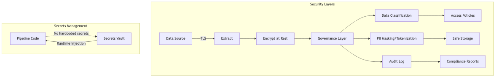

- **Least privilege**: minimal roles and permissions.
- **Secrets management**: store API keys in a vault service ([HashiCorp Vault](https://www.vaultproject.io/), [AWS Secrets Manager](https://aws.amazon.com/secrets-manager/), [1Password](https://1password.com/)).
- **Encryption**: at rest and in transit.
- **PII handling**: mask or tokenize sensitive fields where possible.

**Learn more (summaries)**
- OWASP Top 10: web application risk catalog (injection, auth, sensitive data exposure) complementing the API Top 10.
- GDPR compliance: core principles (lawful basis, data minimization, purpose limitation), DSRs, records of processing, and international transfer rules.

---

## Pros and cons quick reference

### Batch

- **Pros**: simpler, cheaper.
- **Cons**: higher latency, backfills can be heavy.

### Streaming

- **Pros**: low latency, incremental updates.
- **Cons**: more components to operate.

### ETL

- **Pros**: curated data at destination.
- **Cons**: less raw history, less flexibility later.

### ELT

- **Pros**: flexible, audit-friendly, reversible.
- **Cons**: relies on downstream compute and governance.

### CDC

- **Pros**: fresh data without full scans.
- **Cons**: requires log access and careful schema changes.

---

## Curated learn-more links (with summaries)

### Data contracts and schemas

- JSON Schema: human/machine-readable JSON validation; drafts specify types, enums, formats, and $ref composition.
- OpenAPI: REST API contract including paths, schemas, auth; enables codegen and contract testing.
- Protocol Buffers: compact binary schemas with codegen; great for gRPC and long-lived event payloads.

### Orchestration

- Dagster docs: software-defined assets, type-checked pipelines, powerful IO managers and observability out of the box.
- Prefect docs: Python-first orchestration with flows/tasks, retry policies, and hosted Orion UI.
- Temporal docs: durable, code-first workflows with state replay, activity retries, and strong guarantees.

### Transformations

- dbt Core docs: model layering (staging/marts), tests, macros, and environment promotion for analytics ELT.
- Spark docs: distributed compute (DataFrame, SQL, streaming), partition/pruning strategies, and performance tuning.

### Streaming

- Kafka docs: topics, partitions, consumer groups, exactly-once semantics (EOSv2), and Streams API.
- Redpanda docs: Kafka-compatible broker with single-binary ops and tiered storage options.
- Kafka Connect: connector framework, offset storage, single message transforms (SMTs), distributed mode.
- Debezium: CDC connectors and outbox pattern; schema history and snapshot modes.

### Validation

- Zod: TypeScript-first runtime validation with static type inference for safer IO boundaries.
- Pydantic: Python model validation, coercion, and error reporting with JSON schema export.
- Circe: Scala JSON codecs with automatic/semi-automatic derivation and composable decoders.

### Observability

- OpenTelemetry docs: traces/metrics/logs, semantic conventions, and collectors/exporters for common backends.

### Data quality

- Great Expectations: declarative expectations, data docs, and validation stores for pipeline gates.
- Soda Core: lightweight checks, SodaCL, and integration with warehouses and orchestrators.

### Lakehouse table formats

- Apache Iceberg: hidden partitioning, snapshots/time travel, and branch/tag support for tables.
- Delta Lake: ACID on Parquet with optimistic concurrency, MERGE INTO, and vacuum/retention controls.
- Apache Hudi: incremental pulls, upserts, and two table types (CoW/MoR) for different latency profiles.

---

## Language choice for portable, system-agnostic integrations

Goal: write once, run anywhere (iPaaS, serverless, containers, schedulers) with minimal vendor lock-in.

Principles for portability
- Keep a pure core: no provider SDKs in core logic; expose small, pure functions (transform, validate, upsert plans) and make I/O adapter-specific.
- Stable, explicit contracts: JSON Schema/Avro/Protobuf for inputs/outputs; strict validation at boundaries.
- Multiple façades: package the core as (a) CLI (stdin JSON → stdout JSON), (b) gRPC/HTTP microservice, and (c) library API. This covers most orchestrators/providers.
- Reproducible builds: lock dependencies (Poetry/uv, npm/pnpm lock, Go modules), containerize with slim bases, pin OS packages.
- Telemetry and policy: OpenTelemetry for traces/metrics/logs; configuration via env (12‑factor); feature flags for provider-specific behavior.

Language options (pragmatic scorecard)
- Python
  - Pros: ubiquitous data ecosystem (Pandas/Arrow/dbt clients), first-class in Airflow/Dagster/Prefect, easy in Lambda/Cloud Run/Functions.
  - Cons: cold starts, packaging conflicts, GIL; careful with CPU-heavy transforms (use vectorized ops).
  - Portability tips: ship as slim container with uv/Poetry; freeze minor version; optional PyOxidizer or Nuitka for single-binary if needed.
- Go
  - Pros: static binaries, fast startup, low memory; excellent for CLI + microservices; easy cross-compile; good fit for Lambda/Cloud Run.
  - Cons: smaller data/transforms ecosystem than Python; JSON ergonomics improved with generics but still verbose.
  - Portability tips: build a single self-contained binary; embed OpenAPI client code; native gRPC.
- TypeScript/Node
  - Pros: great HTTP/webhook ergonomics, rich SaaS SDKs, JSON-first; supported in serverless/orchestrators.
  - Cons: bundling/ESM vs CJS quirks; single-thread event loop; cold starts vs Go.
  - Portability tips: bundle with esbuild; use Zod for schemas; keep core pure TS with separate provider adapters.
- JVM (Java/Scala/Kotlin)
  - Pros: top choice for heavy streaming (Flink/Spark), strong typing/perf, long-running connectors.
  - Cons: heavier images and cold start; best for persistent workers, not tiny Lambdas.
  - Portability tips: run as long-lived jobs; consider GraalVM native where applicable.
- Rust / WASM (WASI)
  - Pros: performance, safety; WASI promises sandboxed portability.
  - Cons: ecosystem maturity for data tooling; WASI support across providers still emerging.
  - Use when: you need high‑perf parsing/crypto libraries shared across language adapters.

Recommended approach
- Default: Python or Go for the core library if portability is the top priority.
  - Python for rich data manipulation and broad orchestrator support.
  - Go for fast startup, static binaries, simple ops.
- Streaming heavy: JVM (Scala/Java) with Flink/Spark; expose outputs as contracts consumed by other stacks.
- JS-first orgs: TypeScript with a CLI and HTTP façade; ensure bundling and Node version pinning.
- Always separate adapters: Airflow/Dagster/Prefect/Temporal/ADF/Step Functions wrappers live in thin modules calling the same pure core.

Portability pattern: CLI JSON in/out (works under any orchestrator)

TypeScript CLI
```ts
#!/usr/bin/env node
import * as fs from 'node:fs';

function transform(record: any) {
  return { id: record.id, email_domain: String(record.email).split('@')[1] };
}

const input = JSON.parse(fs.readFileSync(0, 'utf8')); // stdin
const output = Array.isArray(input) ? input.map(transform) : transform(input);
process.stdout.write(JSON.stringify(output));
```

Python CLI
```python
#!/usr/bin/env python3
import sys, json

def transform(rec: dict) -> dict:
    return {"id": rec["id"], "email_domain": rec["email"].split("@")[1]}

input_json = json.loads(sys.stdin.read())
if isinstance(input_json, list):
    out = [transform(r) for r in input_json]
else:
    out = transform(input_json)
print(json.dumps(out))
```

Go gRPC façade (sketch)
```go
// Define protobuf for Transform(Request) returns (Response)
// Implement server that calls pure core.Transform and returns JSON payloads.
// Package as a single binary; provide HTTP/JSON via grpc-gateway if needed.
```

Operational guidance
- Version the core separately from adapters; publish semver.
- Provide golden test vectors (JSON in/out) and a conformance test so any adapter/provider can validate behavior.
- Treat the CLI as the lowest common denominator; provider wrappers just marshal data to/from it.

---

## Open-source component choices (OSS)

Use proven OSS components per layer. Pick one per layer first; add complexity only when needed.

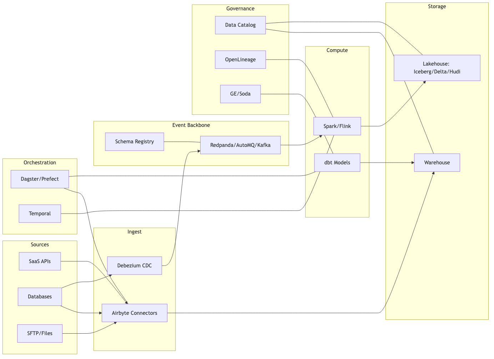

Event backbone
- Redpanda (Kafka-compatible log; single-binary, low ops) — Pros: fast, simple ops; Cons: smaller ecosystem than Kafka.
- AutoMQ (Kafka API on S3 with tiered storage) — Pros: cost-efficient at scale; Cons: S3 latency, newer project.
- Kafka (Apache) — Pros: mature ecosystem; Cons: heavier ops.

Connectors and CDC
- Airbyte (ELT connectors) — Pros: many sources/sinks, OSS; Cons: connector quality varies; pin versions and test.
- Kafka Connect + Debezium (CDC) — Pros: robust CDC; Cons: runs on Kafka stack.

Schema registry
- Apicurio or Confluent Schema Registry — manage Avro/Protobuf/JSON schemas; enforce compatibility (backward/forward/full).

Transformation
- dbt Core (SQL models) — Pros: analytics-friendly; Cons: SQL-only.
- Spark/Flink — Pros: heavy/streaming compute; Cons: ops complexity.

Orchestration
- Dagster/Prefect — Pros: developer-friendly; Cons: scaling needs tuning.
- Temporal — Pros: durable, code-first workflows; Cons: steeper learning curve.

Catalog & lineage
- DataHub/Amundsen (catalog), OpenLineage + Marquez (lineage) — discoverability and end-to-end tracking.

Quality
- Great Expectations/Soda — expectations and data quality checks.

Access/serving
- PostgREST/Hasura/GraphQL or REST microservices; Reverse ETL for SaaS syncs.

---

## Schema governance and registries


Compatibility modes
- Backward-compatible (new producer works with old consumers) for events; Full compatibility for critical payloads.
- Subject naming strategy: topic-name + record-name; version every change; deprecate fields, don’t delete.

Policies
- Disallow breaking changes in CI; require owners/approvers per schema; maintain changelog and samples.
- Add semantic versioning to payloads; include `schema_version` in messages/files.

Validation
- Validate at ingress against the active registry version; log schema drift with alerts.

#### Advanced: contract governance
- Compatibility modes: select per subject (backward for events, full for critical commands); pin and enforce in CI with a registry check step.
- Deprecation policy: add nullable fields + defaults; never reuse fields for new meanings; remove only after all consumers migrate.
- Consumer-driven contracts: publish consumer expectations; run nightly to detect breaking changes from producers.
- Multi-language codegen: generate DTOs from schema (Avro/Protobuf) for TS/Python/Scala to ensure parity; avoid hand-rolled parsers.

---

## Table design and storage (warehouse/lakehouse)

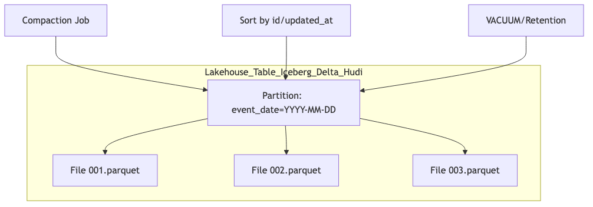

Formats & compression
- Prefer Parquet (columnar) with Snappy/ZSTD.

Partitioning & sorting
- Partition by event_date/ingest_date and tenant/entity; sort by id/updated_at for fast merges.

Small files & compaction
- Schedule compaction; aim for 128–1024MB files; vacuum old snapshots.

ACID tables
- Use Iceberg/Delta/Hudi for ACID, time travel, and merge/upsert support.

Retention & GDPR
- Implement per-table retention; support deletions with row-level deletes and metadata compaction.

#### Advanced: lakehouse operations
- Compaction & clustering: schedule OPTIMIZE/compaction; consider Z-ORDER (Databricks) or clustering keys for query pruning.
- MERGE patterns: small-file writes → stage to temp then MERGE; for very large merges, use partition pruning and bloom filters.
- Change Data Feed (Delta) / incremental reads (Hudi/Iceberg): drive downstream CDC from curated tables.
- Deletes and privacy: use row-level deletes + compaction to physically remove data; verify by snapshot diff and storage scan.
- Cost control: use column pruning and predicate pushdown; precompute heavy joins into denormalized marts where justified.

---

## Error handling, DLQs, and replay

Operational runbooks & incident response
- Cutoffs and holdbacks: define input cutoffs (e.g., T-5m) to absorb late events; publish freshness windows to consumers.
- Feature flags: kill-switch per connector/partner; degrade to batch/polling on webhook failures.
- Rollback: version models and configs; support blue/green for connectors; replay from bronze or DLQ with tags.
- Paging: on-call rotation with runbooks; dashboards include lag, freshness, DLQ rate; auto-quarantine noisy partners.

Error taxonomy
- Distinguish transient (retryable), permanent (validation), and systemic (downstream outage) errors.

Dead-letter queues (DLQ)
- Route permanent failures (with context and sample payload) to DLQ; set retention and access controls.

Replay
- Provide tooling to replay from DLQ/landing zones; ensure idempotent sinks; record replay provenance.

Mermaid: DLQ and replay
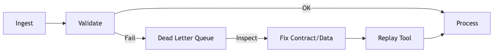

#### Advanced: orchestration, backfills, and reliability
- Backfills: treat as first-class—parameterize by date/partition; isolate compute; cap concurrency to avoid hot partitions.
- Sagas/compensation: for multi-step writes, implement compensating actions and idempotent checkpoints; persist progress markers.
- Retry policies: classify error types; exponential backoff with jitter; circuit breakers on persistent failures; dead-letter after N attempts with context.
- Dependency graphs: dynamic mapping (per-partition fan-out) with sensors for upstream partition completions; avoid global locks.
- Two-phase patterns: outbox/inbox for transactional writes; producer writes to outbox within DB transaction; relay to log asynchronously.

---

## Common deployment environments for integrations


Choose an environment based on connectivity, compliance, scale, skills, and total cost of ownership (TCO). Most teams mix two or more for different flows.

1) iPaaS / Integration Platforms (MuleSoft, Boomi, Workato, Azure Logic Apps, AWS AppFlow)
- Pros: Fast time-to-value, rich connectors, visual flows, built-in retries/monitoring.
- Cons: Vendor lock-in, per-action/run pricing, limited custom logic, source-control friction.
- Fit: SaaS-to-SaaS, simple transformations, business-managed automations.

2) Cloud-native serverless
- AWS: Lambda, Step Functions, EventBridge, SQS/SNS, Glue, S3; Secrets Manager/KMS; PrivateLink.
- Azure: Functions, Logic Apps, ADF, Event Grid, Service Bus; Key Vault; Private Endpoints.
- GCP: Cloud Functions/Run, Workflows, Pub/Sub, Dataflow, Storage; Secret Manager; Private Service Connect.
- Pros: Elastic, pay-per-use, first-class cloud security/networking; minimal ops.
- Cons: Limits (runtime, memory, concurrency), cold starts, observability differences; longer-running jobs need orchestration.
- Fit: Event-driven APIs/webhooks, micro-batch ELT, CDC fan-out.

3) Containers & Kubernetes
- Stack: Kubernetes + orchestration (Argo Workflows/Airflow/Dagster/Temporal), Kafka/Redpanda, Kafka Connect/Debezium, object storage.
- Pros: Portability, full control, stateful/long-running workers, sidecars for auth/observability.
- Cons: Ops overhead (cluster, upgrades, scaling), platform engineering needed.
- Fit: Complex, high-throughput pipelines; hybrid networking; strict customization.

4) Data warehouse/lakehouse–native
- Snowflake Tasks/Streams, BigQuery scheduled queries/Dataform, Databricks Jobs/Delta Live Tables, dbt Cloud/Core.
- Pros: Push down compute close to data; strong lineage/ACLs; simple scheduling.
- Cons: Operational sinks and non-SQL logic harder; connector coverage varies.
- Fit: Analytics ELT, transformations, mart materialization, reverse ETL with connectors.

5) Managed streaming platforms
- Confluent Cloud, Redpanda Cloud, Azure Event Hubs, Amazon MSK Serverless.
- Pros: Durable logs, scalable fan-out, CDC-friendly, replayable.
- Cons: Event modeling and schema governance required; cost at scale; exactly-once needs care.
- Fit: Near-real-time integrations, multi-subscriber architectures, CDC replication.

6) On‑prem / Hybrid / Edge (utilities & regulated)
- Patterns: Self-hosted runtimes, private connectivity (VPN/MPLS), data diodes/DMZ, bastions; Azure IR for on-prem sources.
- Hyper‑V (Windows Server virtualization): Windows/Linux VMs on Hyper‑V hosts with Windows Server Failover Clustering (WSFC) + Live Migration; SCVMM for fleet mgmt; vSwitch/VLANs/NIC teaming/SR‑IOV for network isolation and throughput.
  - Kubernetes on Hyper‑V: k8s clusters using Hyper‑V VMs (kubeadm, Rancher, MicroK8s/K3s) incl. Windows worker nodes; consider Azure Arc or AKS on Azure Stack HCI.
  - CI agents and runtimes: self‑hosted GitHub/Azure DevOps runners, ADF Self‑Hosted Integration Runtime, Power Platform/Power BI on‑prem gateway.
  - Storage: SMB/NFS shares, iSCSI, ReFS; ensure multipath I/O and backups; encrypt at rest (BitLocker) for regulated data.
- Pros: Local data residency, deterministic network, OT segmentation; compliance alignment (CIP/IEC 62443).
- Cons: Hardware/ops cost, slower change management, connector gaps.
- Fit: Plants/substations, on‑prem ERPs/MDMS/LIMS, Windows estates leveraging Hyper‑V, partners restricted to SFTP.

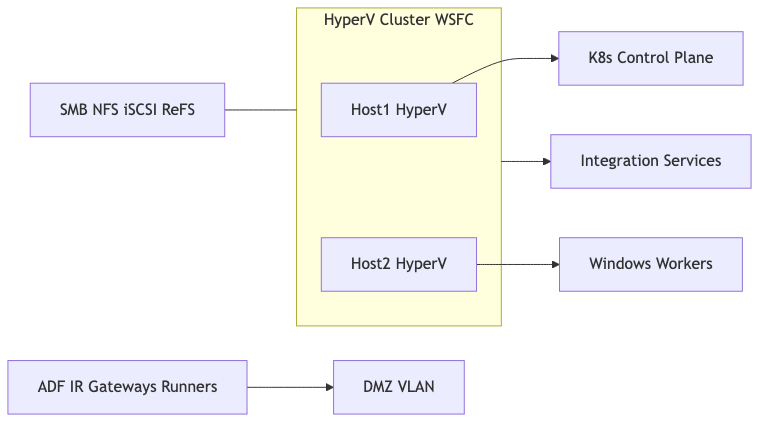

Quick selection
- Mostly SaaS-to-SaaS → iPaaS or serverless.
- Heavy streaming/CDC → managed streaming + containers/serverless consumers.
- Analytics-first → warehouse-native + dbt; operational sinks via services.
- Strict on-prem/OT → Kubernetes on-prem + gateways; file drops with PGP/SFTP.

---

## Environments, CI/CD, and promotion

SQL and pipeline quality gates
- Linting: sqlfluff for SQL style/anti-patterns; black/ruff for Python; golangci-lint for Go.
- Data diff: compare before/after tables (e.g., data-diff/dbt-data-diff) in CI for critical models.
- State-aware builds: dbt build --state to limit work and detect unexpected changes.
- Traceability: propagate OpenTelemetry trace context across extract → queue → transform → load; sample at edges.


- IaC (Terraform, Helm) for infra; GitOps for deployments.
- Separate dev/test/staging/prod with distinct secrets and data stores; forbid production data in lower envs.
- Promotion gates: tests (unit/integ/e2e), schema checks, security scans; change approvals for partner-facing flows.
- Config per env: endpoints, keys, cut-offs; no code changes for env differences.

---

## Privacy in lower environments

- Use synthetic or masked data; maintain referential integrity in masked datasets.
- Redact PII in logs and traces; block secrets/PII from leaving prod.
- Provide data generation scripts for realistic test coverage.

---

## Operational resilience (HA/DR)

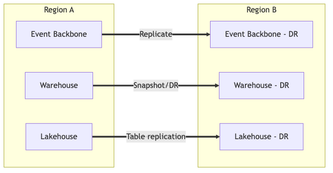

- Define RPO (recovery point) and RTO (recovery time); test disaster recovery regularly.
- Multi-AZ/region for event backbone and stores; replication for catalogs and schema registries.
- Back up configs, schemas, manifests; practice restore drills.

---

## Performance tuning and cost optimization

- Kafka/Redpanda throughput: increase partitions for parallelism; batch produce; enable idempotent producer; tune linger.ms and batch.size.
- Consumer scaling: max.poll.interval and session timeouts; cooperative rebalancing; commit strategies to balance throughput and correctness.
- Warehouse performance: column pruning, predicate pushdown, broadcast joins wisely; cache hot datasets; use vectorized readers.
- Orchestrator scaling: shard runs by partition; prefer small, idempotent tasks; avoid monolithic retries.
- Storage costs: prefer Parquet, compress with ZSTD; compact small files; tier older data to cheaper storage with longer retrieval.

---

## SLIs/SLOs and alerting

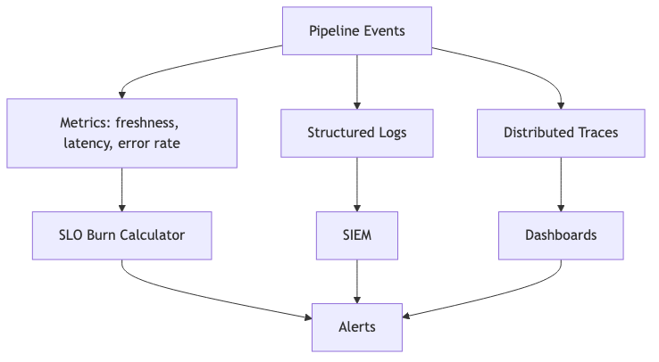

- SLIs: data freshness, on-time delivery %, processing latency p95, error rate, DLQ rate, schema drift rate.
- SLOs: e.g., 99% files processed within 15 minutes of arrival; <0.1% validation failures per day.
- Alerts: page on SLO burn; ticket on chronic drift; dashboards for partner scorecards.

---

## Connector lifecycle and governance

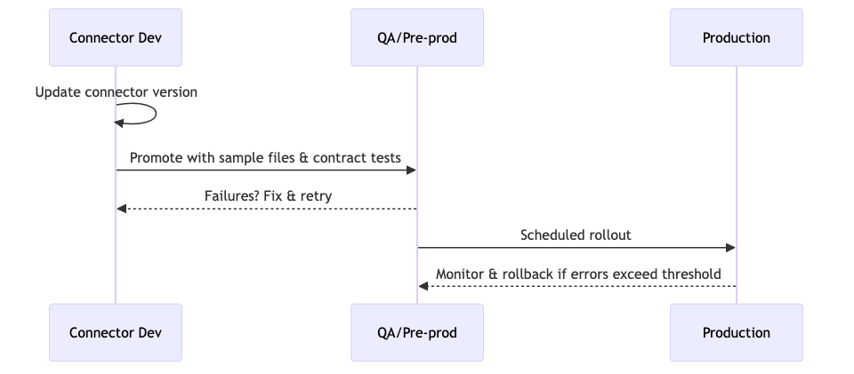

- Pin connector versions (Airbyte/Kafka Connect); stage upgrades in lower env; run contract tests with samples.
- Maintain per-connector runbooks (contact, SLAs, formats, auth, cutoffs); schedule key rotations.

---

## Next steps

1. Start with a small pipeline using batch ELT, schemas, and idempotent writes.
2. Add tests and observability from the beginning.
3. Move to CDC or streaming if freshness requirements demand it.

---

## Notes for contributors

- Keep definitions inline as terms first appear.
- Keep examples short and runnable where possible.
- Maintain an FP-first style: pure core logic, effectful edges, composition.
